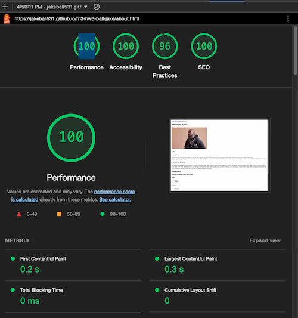
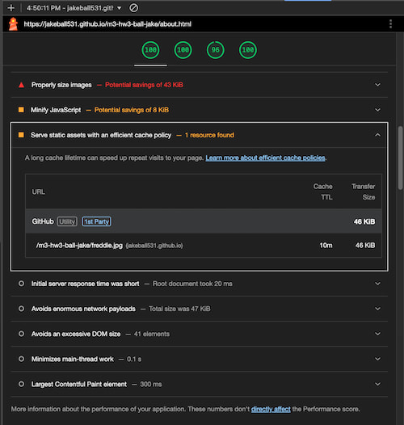
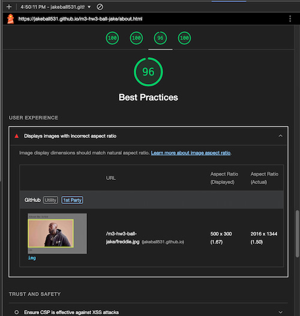

# m3-hw3-ball-jake
## Images

## Resources
* [Freddie Gibbs Wikipedia](https://en.wikipedia.org/wiki/Freddie_Gibbs)

## Stumbling Blocks
Didn't realize that Lighthouse could detect aspect ratio inconsistencies between the loaded image and the original file, which I fixed. Also added an images folder after realizing that it would make things more organized. Other than that, no real issues with the assignment.